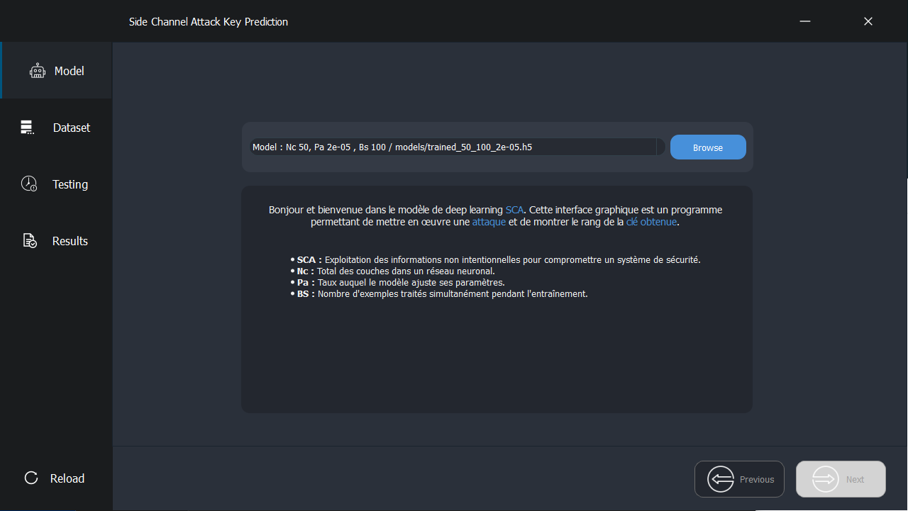
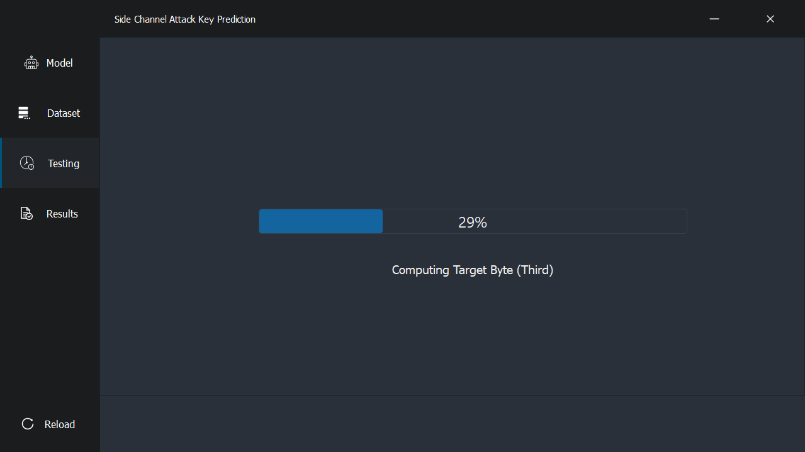
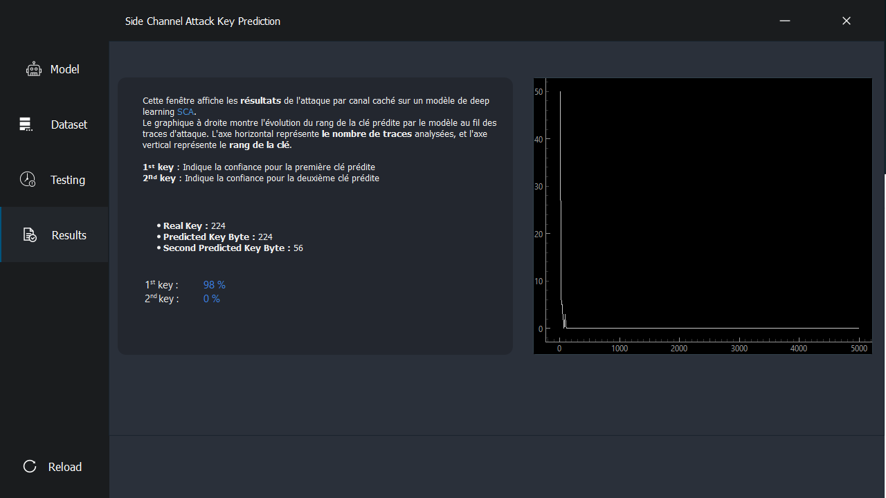

# Side Channel Attack Key Prediction

## Overview
This program is designed to test pre-trained models for side channel attacks using deep learning techniques. It provides a graphical user interface (GUI) to facilitate the implementation and visualization of the attack results.

## Features
- **Model Selection:** Load and test pre-trained models stored in the `models/` folder.
- **Dataset Handling:** Manage and process datasets for testing.
- **Attack Execution:** Perform side channel attacks and predict key bytes.
- **Results Visualization:** Display the confidence levels and prediction accuracy through an intuitive interface.

## Screenshots
The following screenshots provide a visual overview of the application's interface:

### Model Selection


### Testing


### Results


## Requirements
To run this program, ensure you have the following packages installed. You can install them using the `requirements.txt` file.

### requirements.txt
PyQt5
PySide6
tensorflow==2.10.1


## Installation
1. Clone the repository or download the source code.
2. Navigate to the project directory.
3. Create a virtual environment (optional but recommended):
   ```bash
   python -m venv venv
   source venv/bin/activate  # On Windows use `venv\Scripts\activate`
   ```
4. Install required packages:
   ```bash
    pip install -r requirements.txt
   ```

## Usage
To start the application, execute the following command in your terminal:
   ```bash
        python main.py
   ```

## Test Environments
- Anaconda Python 3.10.14
- TensorFlow 2.10.1

## License
This project is licensed under the MIT License. See the **LICENSE** file for more details.

**github@hcn1z1**